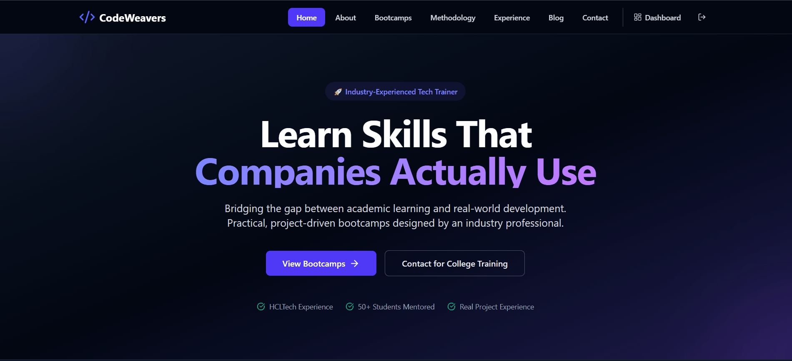

# CodeWeavers 🧩

   

A modern, project-driven learning platform that helps students enroll in bootcamps, submit assignments, earn certificates, and track progress — with a rich admin panel for managing courses, enrollments, certificates, and analytics.

---

## 🎬 Quick Demo

- Overview: 

  

- Student Dashboard:

  

- Admin Dashboard: 

  

---

## ✨ Key Features

- End-to-end course & enrollment management
- Assignments with Git links and file uploads
- Admin grading + in-app notifications
- Premium server-generated certificates (PDF) with verification
- Secure authenticated downloads and uploads
- Admin analytics: users, enrollments, revenue, top courses
- Login streak tracking and student dashboard insights

---

## 🛠️ Tech Stack

- Frontend: React + TypeScript, Vite, Tailwind CSS
- Backend: Node.js (ESM) + Express, MongoDB, Mongoose
- Auth: JWT + Google Oauth (optional)
- Payments: Stripe (checkout + webhooks)
- PDF: PDFKit for server-generated certificates
- Charts: ApexCharts (react-apexcharts)

---

## 🏛 Architecture Overview

- Frontend (React) communicates with the backend API (`/api/*`) over HTTPS.
- Backend (Express) exposes REST endpoints and generates server-side assets (PDF, uploads).
- Stripe is used for payments (checkout + webhooks) and must be configured in production.
- Uploads currently use local file storage (dev). In production, we recommend S3/GCS.

Quick diagram:

Frontend (Vite) ↔ Backend (Express + MongoDB)
                ↕
         Stripe (webhooks)  
         Uploads (S3 recommended)

---

## 🚀 Quick start (local)

Prerequisites:
- Node.js 18+ (or the project's target), pnpm/npm/yarn
- MongoDB instance (local or remote)

1. Clone

```bash
git clone https://github.com/yourorg/CodeWeavers.git
cd CodeWeavers
```

2. Install

```bash
# backend
cd backend && npm install
# frontend
cd ../frontend && npm install
```

3. Create environment files

- create `.env` for backend and and frontend.

.env suggestions (backend):
```bash
PORT=5000
NODE_ENV=development
MONGODB_URI=mongodb://localhost:27017/codeweavers
JWT_SECRET=secret
FRONTEND_URL=http://localhost:5173
STRIPE_SECRET_KEY=sk_test_...
STRIPE_WEBHOOK_SECRET=whsec_...
```

Frontend env (optional):
```bash
VITE_API_URL=http://localhost:5000/api
```

4. Start backend and frontend (two terminals)

```bash
# backend
cd backend
npm run dev

# frontend
cd frontend
npm run dev
```

Open: Frontend → http://localhost:5173


## 🔑 Environment variables (important)

Backend (partial list):

- PORT - server port (default 5000)
- NODE_ENV - development|production
- MONGODB_URI - MongoDB connection string
- JWT_SECRET - JSON Web Token secret
- FRONTEND_URL - frontend public URL (used for redirects)
- STRIPE_SECRET_KEY - Stripe secret key
- STRIPE_WEBHOOK_SECRET - Stripe webhook signing secret
- CERTIFICATE_LOGO_PATH / CERTIFICATE_SIGNATURE_PATH - optional default images

Frontend (partial list):
- VITE_API_URL - API base URL (e.g., https://api.example.com)

---

## 🔁 Seed & Create Admin

CLI / Mongo shell example to create an admin user quickly (adjust to your user model):

```js
const db = connect('mongodb://localhost:27017/codeweavers');
db.users.insertOne({ name: 'Admin', email: 'admin@example.com', password: 'hashedpassword', role: 'admin', isActive: true, createdAt: new Date() });
```

Or implement a one-off script that creates an admin account using your app's hashing and validation.

---

## ⚙️ Important Endpoints & Examples

- GET /api/admin/settings — admin-only settings (GET/PUT)
- GET /api/users/stats/summary — KPIs
- GET /api/enrollments/stats/daily?days=30 — enrollments by day
- GET /api/courses/stats/top-enrollments?days=30 — top courses
- GET /api/payments/stats/revenue?days=30 — revenue per day
- POST /api/uploads/courses — upload images (multipart/form-data)

---

## 🔐 Production Checklist & Troubleshooting

- Ensure backend is behind HTTPS reverse proxy and set `app.set('trust proxy', true)` (prevents mixed-content image URLs).
- Configure Stripe keys and verify webhooks. Use the `STRIPE_WEBHOOK_SECRET` to validate signatures.
- Use cloud storage for uploads in production (S3/GCS) and update upload URLs accordingly.
- Consider enabling Redis caching for heavy aggregation endpoints (analytics) and background workers for expensive jobs (PDF generation, email sending).

Common issue: "Mixed content (http image)" — ensure FRONTEND_URL and any server-generated absolute URLs use https and the proxy forwards `X-Forwarded-Proto`.

---

## 🧪 Tests & Linting

- Run ESLint and unit tests (if added):

```bash
# frontend
cd frontend && npm run lint
# backend
cd backend && npm run lint
```

Add tests under `tests/` for critical paths (settings, payments webhooks, certificate generation).

---

## 🤝 Contributing

1. Fork the repo
2. Create a branch: `feature/your-feature`
3. Open a PR describing the change

Code style: follow TypeScript rules, pre-commit hooks (if configured)

---

## 📄 License

MIT © CodeWeavers

---

## ✉️ Contact

Questions or feedback? dwarika.kumar9060@gmail.com

Happy coding! ✨
